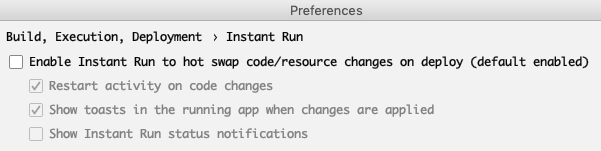

# Andoid Studio 常见问题

### 错误 ```:transformClassesWithExtractJarsForDebug```

- 错误详情

```
org.gradle.api.tasks.TaskExecutionException: Execution failed for task ':transformClassesWithExtractJarsForDebug'.
```

```
Unexpected scopes found in folder 'build/intermediates/transforms/InjectTransform/debug'. Required: SUB_PROJECTS. Found: EXTERNAL_LIBRARIES, PROJECT, SUB_PROJECTS
```

- 解决方案

```
关掉 instant run
```




### kotlin版本冲突

- 问题现象

```
w: Runtime JAR files in the classpath should have the same version. These files were found in the classpath:
    ~/.gradle/caches/modules-2/files-2.1/org.jetbrains.kotlin/kotlin-stdlib-jdk8/1.2.30/f916048adc012c9342b796a5f84c0ac6205abcac/kotlin-stdlib-jdk8-1.2.30.jar (version 1.2)
    ~/.gradle/caches/modules-2/files-2.1/org.jetbrains.kotlin/kotlin-stdlib-jdk7/1.3.20/aa17d6fd473ce53061a7b2b9d2ae96f547cae93d/kotlin-stdlib-jdk7-1.3.20.jar (version 1.3)
    ~/.gradle/caches/modules-2/files-2.1/org.jetbrains.kotlin/kotlin-stdlib/1.3.20/eb2a232734e09fcd1b958a5c7520a93c6de38b32/kotlin-stdlib-1.3.20.jar (version 1.3)
    ~/.gradle/caches/modules-2/files-2.1/org.jetbrains.kotlin/kotlin-stdlib-common/1.3.20/7d7934e26ce34da1a0a8d00e38038d7cf3375e89/kotlin-stdlib-common-1.3.20.jar (version 1.3)
w: Some runtime JAR files in the classpath have an incompatible version. Consider removing them from the classpath
```

- 解决方案


根据 项目 build.gradle 中配置的kotlin版本号

```
kotlin_version = '1.2.40'
classpath "org.jetbrains.kotlin:kotlin-gradle-plugin:$kotlin_version"
classpath "org.jetbrains.kotlin:kotlin-stdlib:$kotlin_version"
```

调整Android Studio中配置的Kotlin编译器版本号

```
操作路径： Android Studio -> Preferences -> Kotlin Compiler
Language version 和 API version 为 1.2
```


## 参考资料

- [Android Studio常见错误集](http://xyzlf.cn/2017/04/10/android-studio-error.html)
- [How to configure Kotlin version in Android Studio?](https://stackoverflow.com/questions/45158803/how-to-configure-kotlin-version-in-android-studio/45158914)