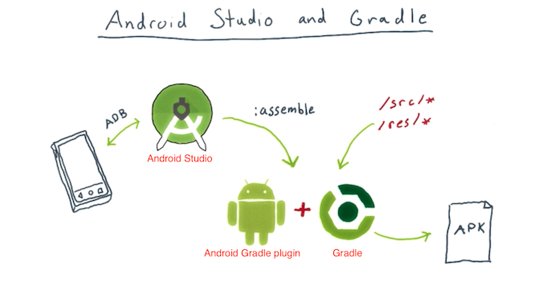

# Andoid - Android Gradle plugin 和 Gradle

## 概念和实体

### 1.1 Android Gradle plugin 和 Gradle 之间的关系



### 1.2 Android Gradle plugin


Android Gradle plugin 也叫 Android plugin for Gradle，是用来联系Android Studio和Gradle的。

Android Gradle plugin在build.gradle中以依赖项 com.android.tools.build:gradle 的形式配置

```
buildscript {
    dependencies {
        classpath 'com.android.tools.build:gradle:3.3.0'
    }
}
```

### 1.3 Gradle

- 1.2.1 Gradle在文件```gradle/wrapper/gradle-wrapper.properties```中配置

```
distributionUrl = https\://services.gradle.org/distributions/gradle-4.10.1-all.zip
```

- 1.2.2 Gradle下载后的目录

```
~/.gradle/wrapper/dists/
```

## 参考资料

- [Android Gradle plugin release notes](https://developer.android.com/studio/releases/gradle-plugin.html#updating-gradle)
- [Android Studio - Configure your build](https://developer.android.com/studio/build/index.html)