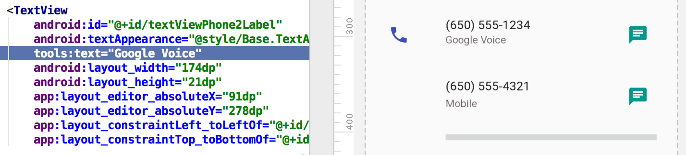

# Andoid - 布局预览

## 关键方法

在目标XML文件的根root标签添加tools命名空间

```xml
<RootTag xmlns:android="http://schemas.android.com/apk/res/android"
    xmlns:tools="http://schemas.android.com/tools" >
```


将前缀 ```android:```替换为```tools:```，就可以指定预览时生效的属性

```
<LinearLayout
        android:visibility="gone"
        tools:visibility="visible">
```

上面的tools:visibility将原本android:visibility隐藏的布局在预览中显示出来



## 参考资料

- [Tools attributes reference](https://developer.android.com/studio/write/tool-attributes)