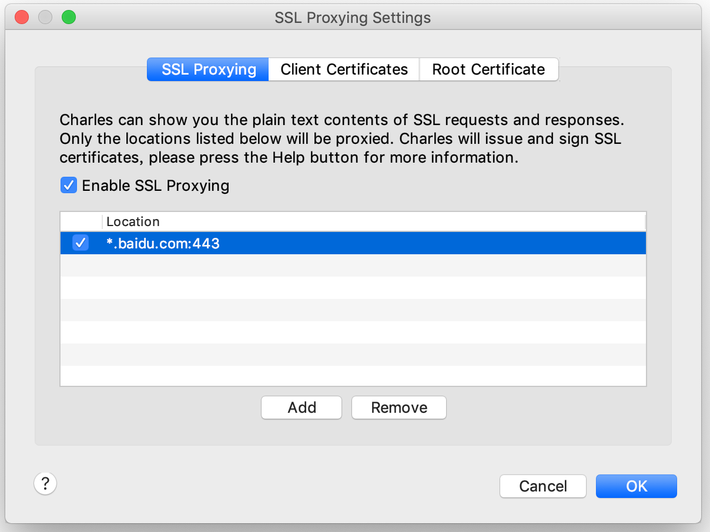

# iPhone上使用Charles进行HTTPS抓包

## 一、配置HTTP代理

在Mac上启动Charles，点击菜单 Help -> Local IP Address

查看IP地址

在iPhone的HTTP代理页面填入上述IP地址，端口号缺省为8888

这时，就可以在iPhone上浏览HTTP网页，在Mac上的Charles即可看到抓取到的HTTP请求和响应

## 二、配置HTTPS证书

### 2.0 首先，配置HTTP代理

### 2.1 查看Charles证书安装说明

在Mac上点击Charles菜单 Help -> SSL Proxying -> Install Charles Root Certificate on a Mobile Device or Remote Browser

看到操作提示信息

### 2.2 安装Charles证书并启用完全信任

按照上面的安装说明信息，

- 第一步：在iPhone上打开Safari浏览器，地址栏中输入 'chls.pro/ssl' 点击前往，在跳转的设置页面中点击“安装” Charles Proxy CA：

- 第二步：在iPhone上对刚安装的证书启用完全信任，如下图所示：

设置 -> 通用 -> 关于本机 -> 证书信任设置 -> Charles Proxy CA

### 2.3 Charles中配置要抓取的SSL主机

这时，就可以在iPhone上浏览HTTPS网页，在Mac上的Charles即可看到抓取到的HTTPS请求和响应明文

### 