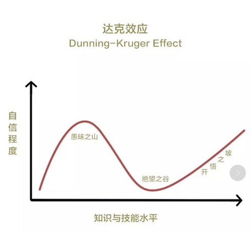
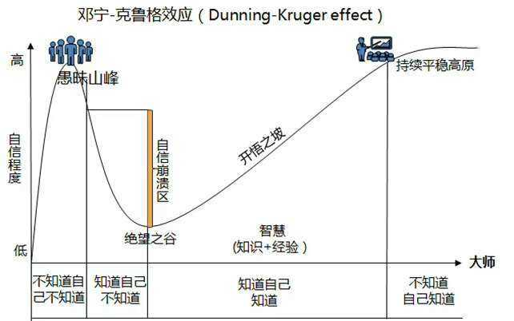
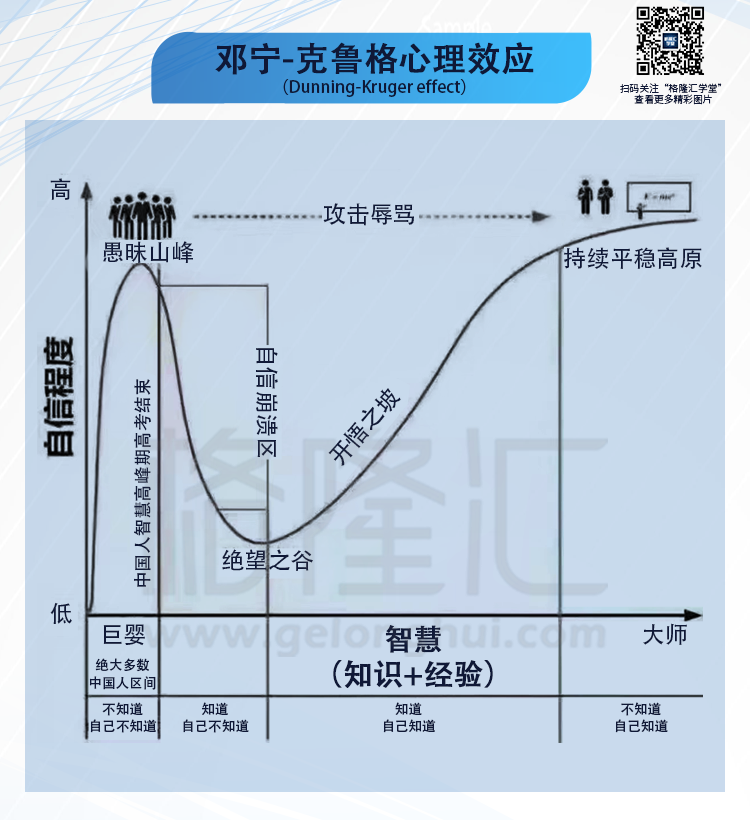
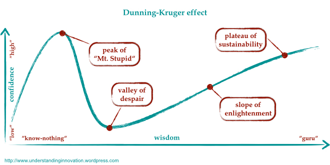

## 达克效应

#### 中文原始版

#### 中文注释版

#### 中文演义版

#### 英文原始版

#### 英文注释版

## 参考信息

- [邓宁-克鲁格心理效应 - 中文版图示](https://img3.gelonghui.com/201811/p20181117191123106.png)
- [Dunning-Kruger effect - English Version](https://understandinginnovation.blog/2015/07/03/the-dunning-kruger-effect-in-innovation/)
- [Why incompetent people think they're amazing - David Dunning](https://www.youtube.com/watch?v=pOLmD_WVY-E)