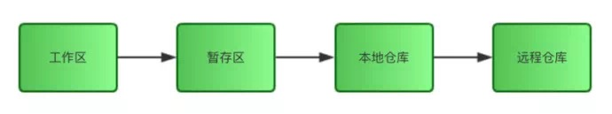
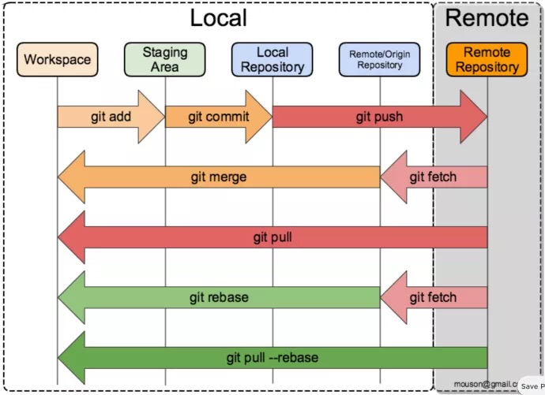
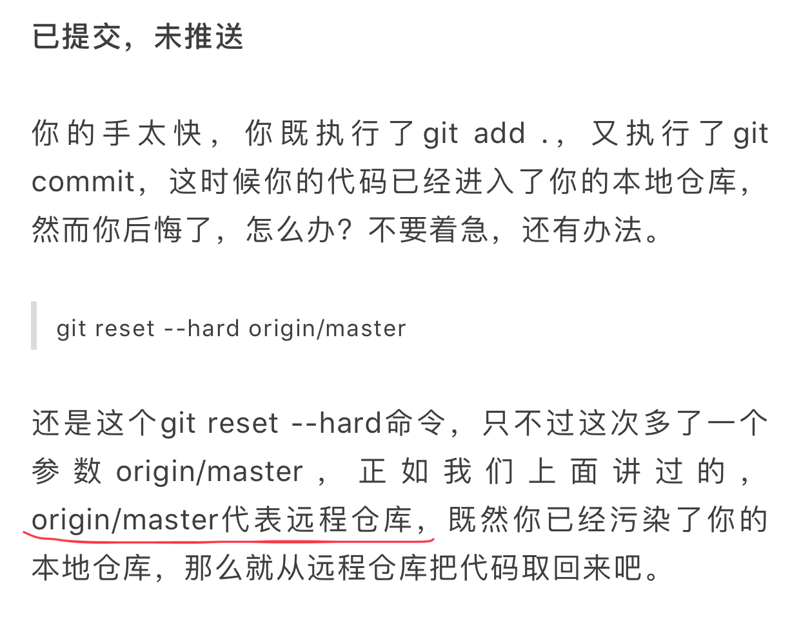

## Git基础概念

## Git常用命令

中文名词 | 英文名词
------ | --------
工作区 | Workspace
暂存区 | Staging Area
本地仓库 | Local Repository
远程仓库 | Remote Repository
远程仓库的本地镜像 | Remote/origin Repository

## Git使用示例

## ToDo - 迷惑的地方

- 困惑一：暂存区(Staging Area)到底是哪里？.git目录下哪一部分？怎么查看其物理存储？

- 困惑二：Remote Repository 和 Remote/origin Repository的关系是啥？Remote/origin Repository到底在哪里？.git目录下哪一部分？怎么查看其物理存储？

- 困惑三：上图中的git merge/pull/rebase/pull --rebase的图示是否正确？

