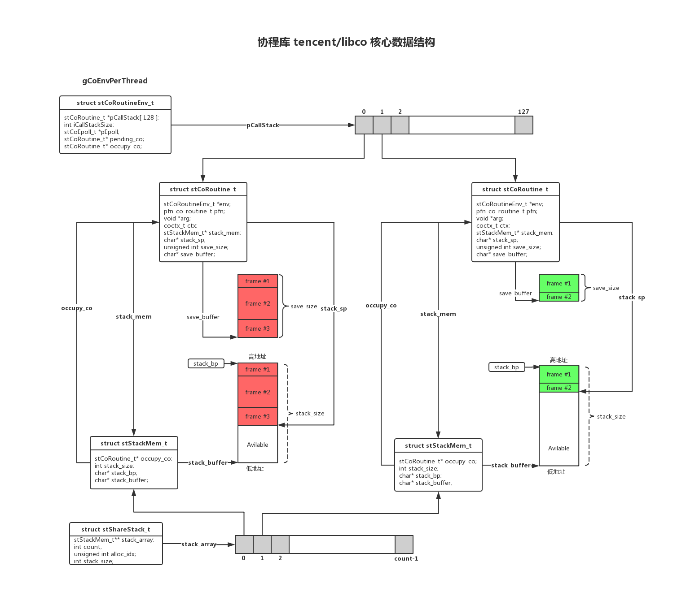

### 备注

- 流程图-绘图工具：[https://www.processon.com](https://www.processon.com)
- 流程图-绘图源码：[libco.pos](libco.pos)
- libco源代码: [https://github.com/Tencent/libco](https://github.com/Tencent/libco)
- libco简介：libco是微信后台大规模使用的c/c++协程库，2013年至今稳定运行在微信后台的数万台机器上。