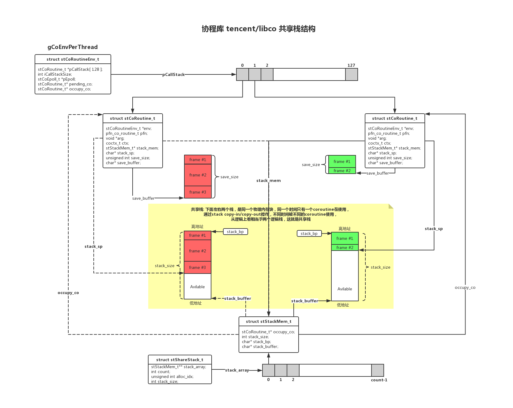

### 开源代码-libco

- libco源代码: [https://github.com/Tencent/libco](https://github.com/Tencent/libco)
- [微信如何用 libco 支撑8亿用户](https://www.oschina.net/news/78542/how-wechat-support-800-million-users-by-libco)

### 流程图

- 绘图工具：[https://www.processon.com](https://www.processon.com)
- 绘图源码：[libco.pos](libco.pos)

### 参考资料

- [关于共享栈的学术论文《A Portable C++ Library for Coroutine Sequencing》(pdf)](http://akira.ruc.dk/~keld/research/COROUTINE/COROUTINE-1.0/DOC/COROUTINE_REPORT.pdf)
- [stack和stack frame](https://www.cnblogs.com/lian--ying/p/9159636.html)
