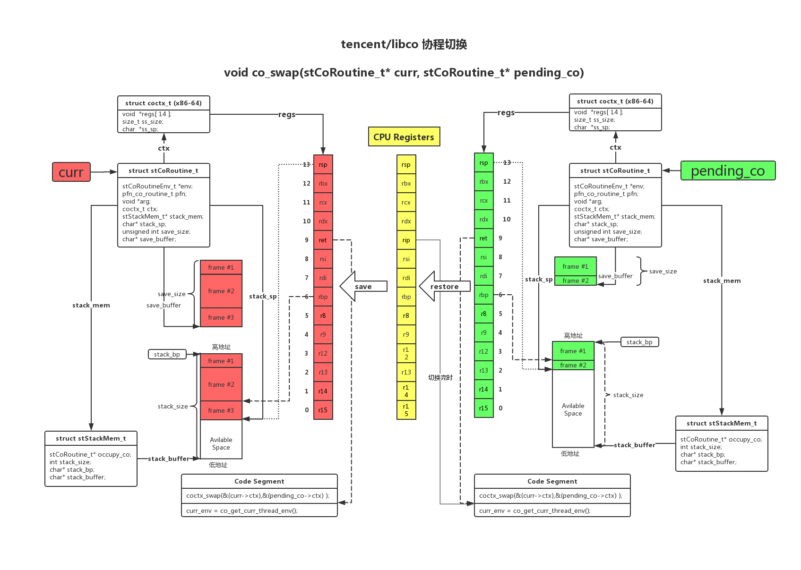

### 开源代码-libco

- libco源代码: [https://github.com/Tencent/libco](https://github.com/Tencent/libco)
- libco简介：libco是微信后台大规模使用的c/c++协程库，2013年至今稳定运行在微信后台的数万台机器上。

### 流程图

- 绘图工具：[https://www.processon.com](https://www.processon.com)
- 绘图源码：[libco.pos](libco_swap.pos)

### 参考资料

- [x86-64 下函数调用及栈帧原理](https://zhuanlan.zhihu.com/p/27339191)

### 社区讨论

- [libco源代码解析之coctx_swap.S(i386架构)](https://zxylvlp.github.io/blog/coctx_swap.html)
- [微信如何用 libco 支撑8亿用户](https://www.oschina.net/news/78542/how-wechat-support-800-million-users-by-libco)
- [libco设计实现的讨论](https://www.zhihu.com/question/52193579/answer/447612082)
	- [coctx_swap违反Sys V ABI约定](https://github.com/Tencent/libco/issues/90)
	- [libaco-更好用的libco](https://github.com/hnes/libaco)
